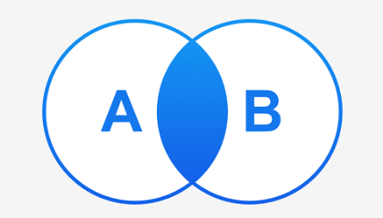

1. 笛卡尔积
   1. 选取一张表，我们称之为【驱动表】，从驱动表中开始查询，找到满足条件的数据（如果没有条件就依次全部取出）。 
   2. 根据从驱动表查询的这条数据，以及其他条件，去第二张【被驱动表】中查询，并将结果进行拼接。 
   3. 依次类推，从驱动表获取第二条数据，使用该数据和条件，再次查询【被驱动表】进行查询。 
   4. 整个过程，会查询【驱动表】一次，查询【被驱动表】多次。
   对于没有使用查询条件的连表查询，查询结果就是两张表的**笛卡尔积**
2. 内连接 

    
    - 使用逗号分割两张表进行查询，mysql经过优化默认就等效与内连接， 
    - 内连接使用关键字 【inner join】 或 【join】 来连接两张表。 
    - 内连接中，【驱动表】是系统优化后自动选取的，会将执行计划中【扫描次数少】的表选做【驱动表】
    - 等效的三条DQL
        ``` sql
        SELECT * from teacher t ,course c where c.t_id = t.id
        SELECT * from teacher t join course c on c.t_id = t.id
        SELECT * from teacher t inner join course c on c.t_id = t.id
        ```
3. 外连接
    - 内外连接的区别
        - 对于【内连接】中的两个表，若【驱动表】中的记录在【被驱动表】中找不到与之匹配的记录，则该记录不会被加入到最后的结果集中。 
        - 对于【外连接】中的两个表，即使【驱动表】中的记录在【被驱动表】中找不到与之匹配的记录，也要将该记录加入到最后的结果集中。 
        - 针对不同的【驱动表的选择】，又可以将外连接分为【左外连接】和【右外连接】。
        - 对于左外连接查询的结果会包含左表的所有数据，对于右外连接查询的结果会包含右表的所有数据
   1. 左外连接
      `SELECT * from course c left outer join  teacher on t c.t_id = t.id`
   2. 右外连接
      `SELECT * from teacher t right join course c on  c.t_id = t.id`
4. 子查询

   [006-子查询.md](006-子查询.md)
   - 标量子查询：结果集一行一列 （又称为单行子查询） 
   - 列子查询： 结果集一列多行 
   - 行子查询： 结果集一行多列 
   - 表子查询： 结果集可多行多列
