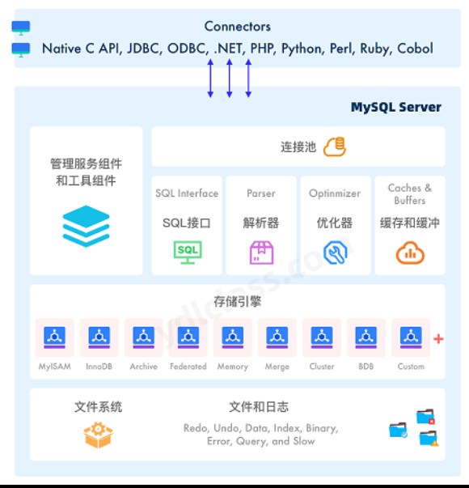
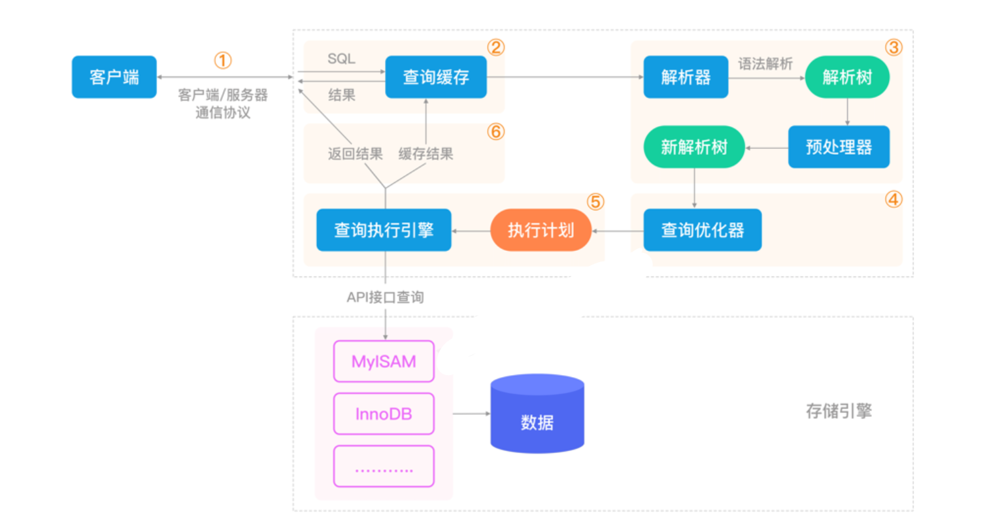

# mysql的系统架构

1. 数据库和数据库实例
   数据库：按照数据结构来组织、存储和管理数据的仓库，通常由数据库管理系统进行管理。

   数据库管理软件（RDBMS）：数据库管理软件，例如Navicat，MySQL。

   数据库实例：启动数据库软件，在内存中运行一个独立进程，用来操作数据，这个正在运行的进程就是一个数据库实例。

2. MySQL架构

   

   流程：
    1. 查询SQL，查询缓存中有则返回，没有进入下一步
    2. 解析器语法解析SQL，生成解析树
    3. 生成的解析树通过查询优化器，优化语法树生成执行计划【MySQL寻找更完美的SQL解决方案】
    4. 执行引擎执行执行计划，最后返回result
   
    - MySQL8.0为什么取消了查询缓存？
      查询缓存的底层是Hash表。K是SQL，V是result。 
      设置查询缓存的目的是优化重复查询。缺点是一个微小的改变会对Hash值产生巨大的变化，数据一旦发生变化，查询缓存就失效了。适合查询多修改少的场景。 
      设计缓存的目的是减少性能开销，但为了维护缓存又带来的更多的开销， 
      所以MySQL8.0取消了查询缓存。 
      改用内存数据库【例如Redis】代替查询缓存
